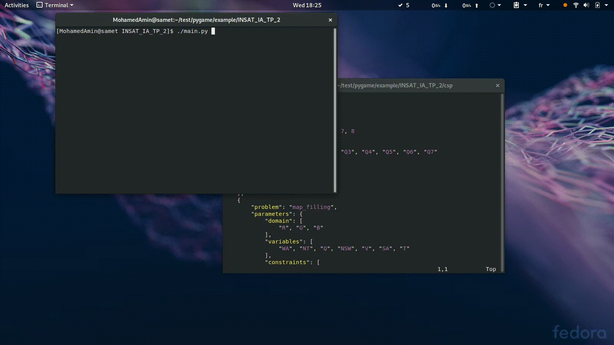

# IA TP_2
compte rendu du TP2 Intelligence Artificille par SAMET MohamedAmin et DGHAIS Ahmed.

# Description
Multi-game solving problem using as in input: "domain", "variables" and "constraints" form `./csp/csp.json` file

# Dependencies
- `python3`
- `pygame`

# Demonstration
## N_Queens:
### Backward Solving

### Forward Solving

## Map_Filling
### Backward Solving

### Forward Solving

